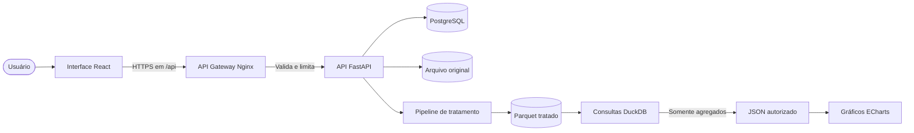
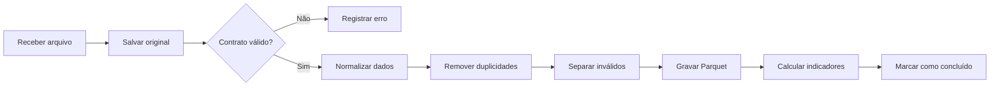

# Arquitetura simples do gerenCIA

Status: rascunho inicial simplificado  
Objetivo: permitir que o usuário envie um arquivo, tratar os dados e exibir gráficos, concentrando a dificuldade do projeto nos fundamentos de engenharia de dados.

## 1. Fluxo principal



Em termos práticos:

```text
Usuário
  -> seleciona um arquivo
  -> React envia o arquivo ao API Gateway
  -> Nginx aplica rate limiting e encaminha a requisição
  -> FastAPI recebe e salva o original
  -> PostgreSQL registra usuário, upload e status
  -> Pandas valida e trata os dados
  -> resultado tratado é salvo em Parquet
  -> DuckDB calcula os indicadores
  -> API devolve JSON
  -> ECharts exibe os gráficos
```

## 2. Tecnologias

| Parte | Tecnologia | Motivo |
|---|---|---|
| Interface | React, TypeScript e Vite | Interface organizada e extensível |
| Gráficos | Apache ECharts | Gráficos interativos no próprio React |
| API Gateway | Nginx | Entrada única, roteamento e rate limiting |
| API | FastAPI | Recebimento do arquivo e endpoints dos gráficos |
| Tratamento | Pandas | Leitura, limpeza e transformação dos dados |
| Arquivo tratado | Parquet | Formato colunar usado em engenharia de dados |
| Consultas | DuckDB | SQL analítico diretamente sobre Parquet |
| Dados do sistema | PostgreSQL | Usuários, uploads, status e permissões |

### 2.1 Separação dos bancos

O PostgreSQL é o banco operacional da aplicação. Ele armazena:

- usuários e autenticação;
- informações e permissões do sistema;
- metadados dos arquivos enviados;
- status e resultado de cada processamento;
- caminho dos arquivos brutos, tratados e rejeitados.

O DuckDB é o mecanismo analítico. Ele:

- consulta os arquivos Parquet tratados;
- executa agregações e filtros;
- calcula os dados enviados aos gráficos;
- não armazena usuários, autenticação ou configurações do sistema.

Os mesmos dados analíticos não devem ser copiados para os dois bancos sem necessidade. O PostgreSQL guarda o controle do processo; o Parquet guarda os dados tratados; o DuckDB consulta esses arquivos.

### 2.2 Frontend como camada visual

O código React é executado no navegador e deve ser considerado público. Portanto, o frontend:

- não contém senhas, chaves de API ou credenciais de banco;
- não acessa PostgreSQL, DuckDB ou arquivos Parquet diretamente;
- não executa regras de autorização;
- não calcula métricas de negócio a partir dos dados brutos;
- recebe somente os campos necessários para a tela atual;
- chama apenas rotas relativas iniciadas por `/api`.

Variáveis incluídas pelo Vite no bundle também são públicas. Nenhum segredo deve ser armazenado em variáveis `VITE_*`.

O navegador necessariamente consegue visualizar os dados usados para desenhar um gráfico. Por isso, dados sensíveis devem ser removidos ou agregados no backend antes da resposta. Se uma tela mostra apenas totais mensais, a API não deve enviar nomes, documentos ou todas as linhas do arquivo.

### 2.3 API Gateway e rate limiting

O Nginx será o único ponto público para as chamadas da aplicação. O FastAPI e os bancos permanecem em rede interna.

Responsabilidades do gateway:

- aceitar somente HTTPS em produção;
- encaminhar `/api/*` para o FastAPI;
- bloquear métodos e rotas não permitidos;
- limitar o tamanho do upload;
- aplicar rate limiting por IP;
- devolver HTTP `429 Too Many Requests` quando o limite for excedido;
- adicionar cabeçalhos básicos de segurança;
- registrar IP, rota, status e duração da requisição, sem registrar conteúdo sensível.

Limites iniciais sugeridos, configuráveis por ambiente:

| Rota | Limite inicial | Motivo |
|---|---:|---|
| `/api/auth/login` | 5 requisições por minuto por IP | Reduzir tentativas automatizadas |
| `POST /api/uploads` | 10 requisições por hora por IP | Proteger CPU, memória e armazenamento |
| `/api/uploads/*` | 30 requisições por minuto por IP | Consultar processamento |
| `/api/uploads/*/charts/*` | 60 requisições por minuto por IP | Permitir filtros do dashboard |

Na primeira versão, os contadores podem permanecer na memória do Nginx. Redis só passa a ser necessário se houver várias instâncias do gateway compartilhando o mesmo limite.

O rate limiting protege disponibilidade, mas não substitui autenticação e autorização. O FastAPI ainda deve validar se o usuário autenticado pode acessar o `upload_id` solicitado.

Não entram nesta primeira versão:

- Airflow;
- Kafka;
- Spark;
- dbt;
- Kubernetes;
- Redis;
- data lake em nuvem;
- microserviços.

Essas ferramentas só devem ser consideradas se surgir uma necessidade concreta.

## 3. Onde fica a dificuldade de engenharia de dados

A parte relevante do projeto será o pipeline de tratamento, não a quantidade de infraestrutura.

### 3.1 Preservação do dado bruto

Todo arquivo enviado é salvo sem alterações:

```text
data/raw/{upload_id}/arquivo_original.csv
```

Isso permite auditoria, comparação e reprocessamento.

### 3.2 Validação

Antes do tratamento, o sistema verifica:

- extensão e tamanho do arquivo;
- existência das colunas obrigatórias;
- colunas desconhecidas;
- linhas completamente vazias;
- tipos que podem ser convertidos;
- datas inválidas;
- valores numéricos ou monetários inválidos.

Se o contrato mínimo não for atendido, a API devolve uma mensagem clara informando os problemas encontrados.

### 3.3 Limpeza e padronização

O pipeline deve demonstrar:

- normalização dos nomes das colunas;
- remoção de espaços e caracteres inconsistentes;
- conversão de datas para um formato único;
- conversão de valores como `R$ 1.234,56` para decimal;
- padronização de categorias e textos;
- tratamento explícito de valores ausentes;
- remoção de duplicidades com uma regra documentada;
- separação de registros inválidos.

### 3.4 Saídas do processamento

Cada upload gera dois arquivos:

```text
data/processed/{upload_id}/dados.parquet
data/rejected/{upload_id}/registros_invalidos.parquet
```

O arquivo de rejeitados deve incluir uma coluna `motivo_rejeicao`. Isso demonstra qualidade de dados sem descartar problemas silenciosamente.

### 3.5 Metadados e rastreabilidade

Uma tabela PostgreSQL chamada `uploads` registra:

| Campo | Descrição |
|---|---|
| `upload_id` | Identificador único do envio |
| `original_name` | Nome original do arquivo |
| `file_hash` | Hash para detectar arquivos repetidos |
| `received_at` | Horário do recebimento |
| `status` | `received`, `processing`, `completed` ou `failed` |
| `total_rows` | Quantidade de linhas recebidas |
| `valid_rows` | Quantidade de linhas válidas |
| `rejected_rows` | Quantidade de linhas rejeitadas |
| `finished_at` | Horário de conclusão |
| `error_message` | Erro do processamento, quando houver |

O `upload_id` acompanha o arquivo desde o recebimento até os gráficos. Essa é uma forma simples de demonstrar linhagem de dados.

## 4. Pipeline detalhado



O processamento pode ser síncrono na primeira versão, desde que seja definido um limite de tamanho para os arquivos. Caso os arquivos fiquem grandes, o mesmo pipeline poderá ser movido para um worker em uma evolução futura.

## 5. Contrato inicial do arquivo

Para evitar um sistema excessivamente genérico, a primeira versão deve aceitar um formato de arquivo bem definido. Exemplo para dados financeiros:

| Coluna | Tipo esperado | Obrigatória | Exemplo |
|---|---|---:|---|
| `data` | data | sim | `31/08/2026` |
| `descricao` | texto | sim | `Venda mensal` |
| `categoria` | texto | sim | `Receita` |
| `tipo` | enum | sim | `entrada` ou `saida` |
| `valor` | decimal | sim | `1234,56` |

O contrato definitivo depende do tipo de informação que o gerenCIA analisará.

## 6. API mínima

```text
POST /api/auth/login
POST /api/auth/logout
GET  /api/auth/me
POST /api/uploads
GET  /api/uploads/{upload_id}
GET  /api/uploads/{upload_id}/quality
GET  /api/uploads/{upload_id}/summary
GET  /api/uploads/{upload_id}/charts/cash-flow
GET  /api/uploads/{upload_id}/charts/categories
```

Essas rotas são expostas pelo gateway. A porta interna do FastAPI não deve ser publicada para acesso direto do navegador.

Para a autenticação web, a preferência inicial é uma sessão ou token em cookie com `HttpOnly`, `Secure` e `SameSite`. Tokens de acesso não devem ser guardados no `localStorage`. Requisições que alteram estado também devem receber proteção contra CSRF quando a autenticação usar cookies.

### Exemplo de resposta do upload

```json
{
  "upload_id": "01J7EXAMPLE",
  "status": "completed",
  "total_rows": 1000,
  "valid_rows": 972,
  "rejected_rows": 28
}
```

### Exemplo de resposta para um gráfico

```json
{
  "title": "Fluxo de caixa mensal",
  "unit": "BRL",
  "series": [
    { "period": "2026-06", "income": 12000, "expense": 8300 },
    { "period": "2026-07", "income": 14500, "expense": 9100 }
  ]
}
```

O backend calcula os indicadores. O React apenas seleciona filtros, chama a API e apresenta o resultado.

## 7. Telas da primeira versão

### Upload

- área para arrastar ou selecionar CSV/XLSX;
- informação sobre colunas aceitas;
- botão de processamento;
- mensagens de validação.

### Resultado do processamento

- total de linhas;
- linhas válidas e rejeitadas;
- percentual de qualidade;
- problemas encontrados;
- opção para baixar os registros rejeitados.

### Dashboard

- cards de total de entradas, saídas e saldo;
- gráfico de linha ou barras por período;
- gráfico por categoria;
- filtro de período;
- indicação do arquivo utilizado.

## 8. Estrutura do projeto

```text
gerenCIA/
  gateway/
    nginx.conf
  frontend/
    src/
      pages/
        Upload.tsx
        DataQuality.tsx
        Dashboard.tsx
      components/
      charts/
      services/
  backend/
    app/
      main.py
      api/
        auth.py
        uploads.py
        charts.py
      pipeline/
        contract.py
        normalize.py
        quality.py
        aggregate.py
      storage/
        files.py
        metadata.py
        analytics.py
      models/
    tests/
  data/
    raw/
    processed/
    rejected/
  docs/
    arquitetura.md
  compose.yaml
```

## 9. Testes importantes

Para demonstrar fundamentos de engenharia de dados:

- arquivo sem coluna obrigatória deve ser recusado;
- valores monetários brasileiros devem ser convertidos corretamente;
- datas inválidas devem ir para rejeitados;
- registros duplicados devem seguir uma regra determinística;
- a soma antes e depois do tratamento deve ser reconciliada;
- reprocessar o mesmo `upload_id` não deve duplicar resultados;
- os totais apresentados pela API devem coincidir com consultas DuckDB;
- arquivo vazio ou corrompido deve gerar erro compreensível.
- acesso direto ao FastAPI fora da rede interna deve falhar;
- excesso de requisições no gateway deve retornar HTTP `429`;
- upload acima do limite deve retornar HTTP `413`;
- usuário não autorizado não pode consultar uploads de outro usuário;
- respostas analíticas não devem conter campos sensíveis ou linhas brutas;
- o bundle do frontend não deve conter credenciais ou chaves privadas.

## 10. Ordem de implementação

1. Definir o contrato real do arquivo.
2. Implementar o pipeline Pandas com testes.
3. Salvar bruto, tratado e rejeitados; registrar metadados no PostgreSQL.
4. Criar as consultas DuckDB e endpoints FastAPI.
5. Configurar o Nginx como gateway, com rate limiting e limite de upload.
6. Criar a página de upload.
7. Criar a tela de qualidade.
8. Criar o dashboard React com ECharts.
9. Adicionar Docker somente quando o fluxo local estiver funcionando.

## 11. Resumo da decisão

A primeira versão terá cinco componentes simples:

```text
React + ECharts
Nginx como API Gateway
FastAPI
PostgreSQL para dados do sistema
Pandas + Parquet + DuckDB para dados analíticos
```

Isso mantém a experiência simples para o usuário e ainda demonstra fundamentos relevantes de engenharia de dados: contrato, ingestão, preservação do bruto, limpeza, qualidade, rejeição, formato colunar, consultas analíticas, idempotência e rastreabilidade.
