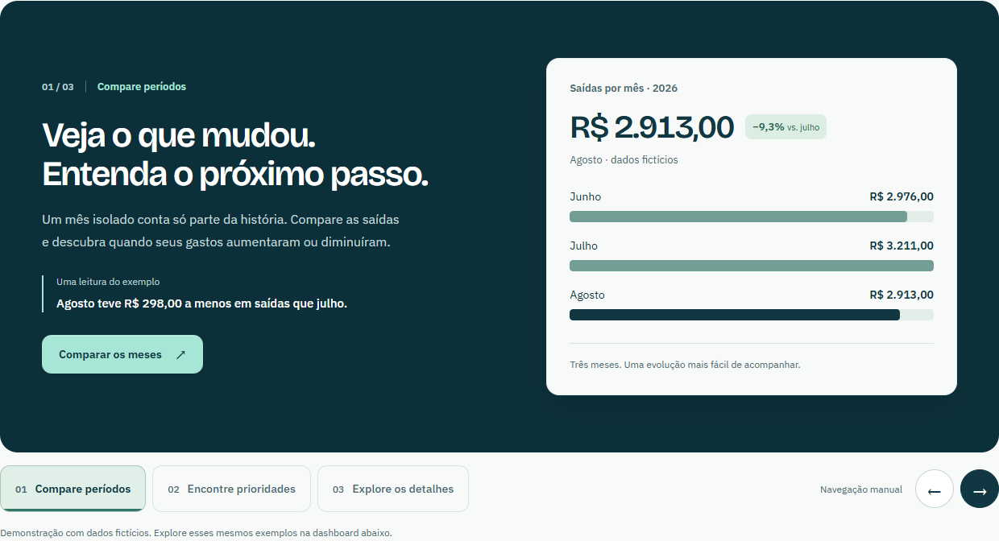
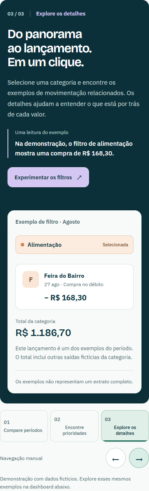
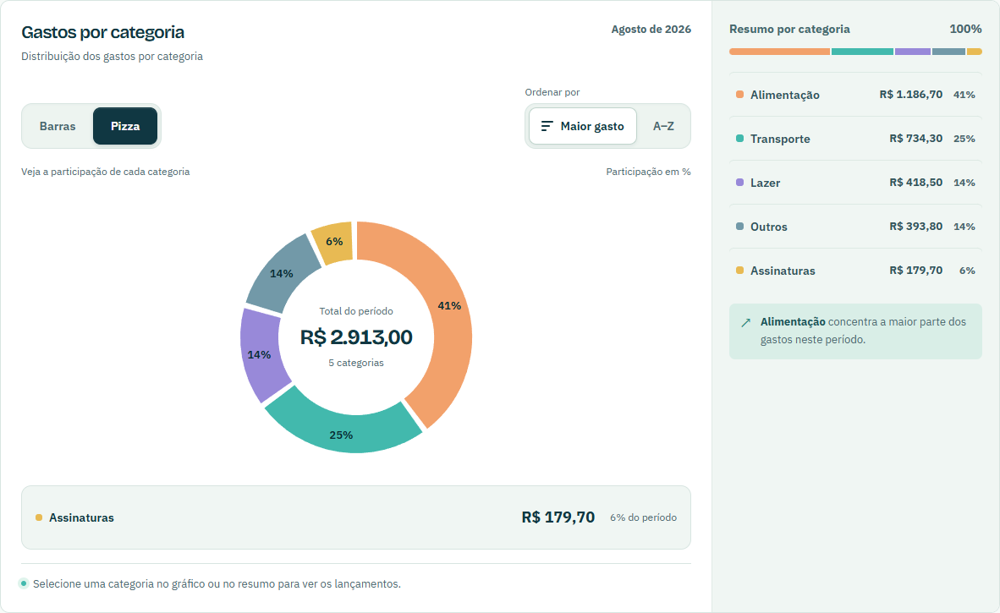

# Botões, carrossel e detalhes do gráfico

Atualização de 27/09/2026.

- Controles de período, tipo de gráfico e ordenação compartilham bordas, tamanhos, estados ativos e foco visível. O seletor nativo “Categoria” foi substituído por botões “Maior gasto” e “A–Z”. A ordenação continua salva no navegador.
- A seção “Números que levam a algum lugar” apresenta três exemplos em um carrossel: evolução mensal, distribuição por categoria e filtro de lançamentos. Os números vêm de `demoData.ts`, a mesma fonte da dashboard.
- Transições discretas, avanço automático a cada 9 segundos, pausa, navegação por botões e setas do teclado. A reprodução pausa sob o mouse, para ao navegar ou focar nos controles e só roda quando a seção está visível. Movimento reduzido desativa animações e reprodução automática.
- Os três slides compartilham a mesma altura calculada por CSS Grid. Os slides inativos são invisíveis, têm `aria-hidden` e `inert`; seus links ficam fora da navegação por teclado.
- Os detalhes de hover das barras e da pizza ocupam uma faixa própria abaixo do gráfico. Nenhum tooltip flutua sobre as fatias, o centro da rosca ou os valores do resumo. A mesma faixa funciona ao focar nos botões de categoria.

Validado no Chrome com Playwright em 320, 390, 768, 1024 e 1440 px: três slides, ordenação, todos os hovers da pizza, estabilidade da altura, teclado, reprodução, pausa e mudança de movimento reduzido. Axe não detectou violações nas três telas do carrossel. A revisão geral também passou em sete larguras e nas páginas de acesso. Resultados em [checks.json](checks.json).

Repetir com o servidor local na porta 5173 e as dependências isoladas da auditoria:

```powershell
python scripts/check_carousel.py
python scripts/check_dashboard.py
python scripts/check_front_accessibility.py
```






