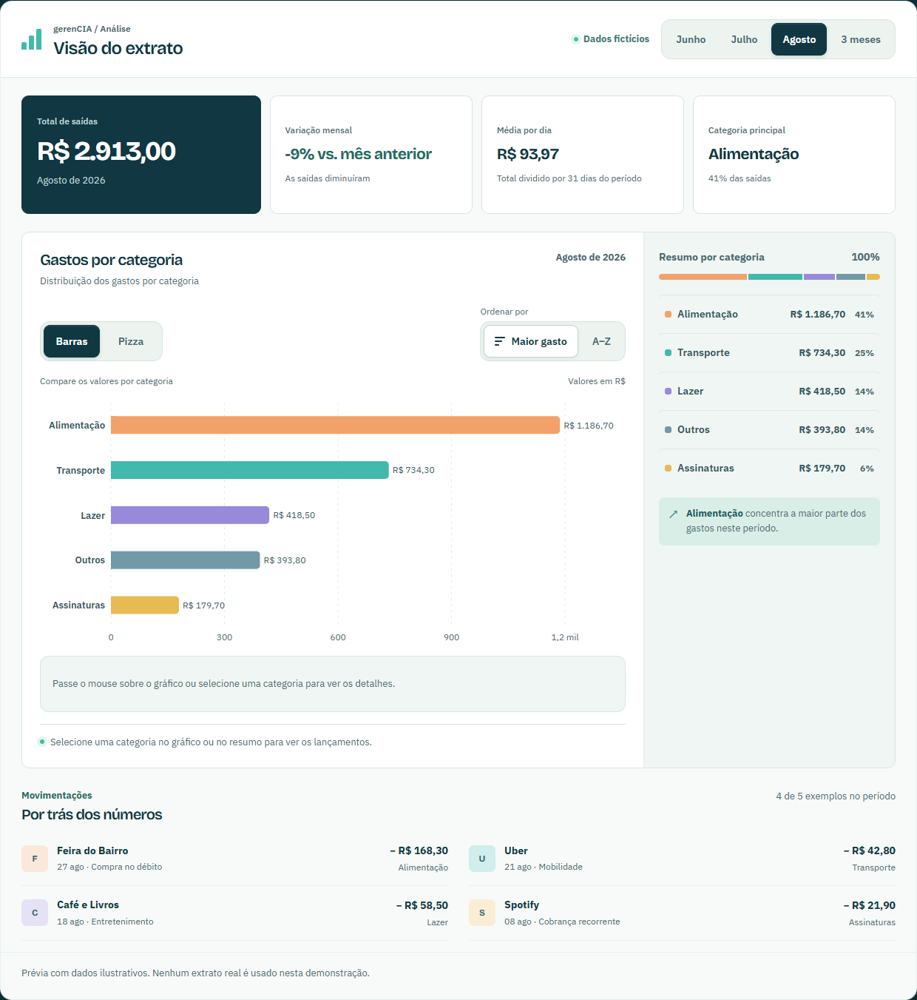
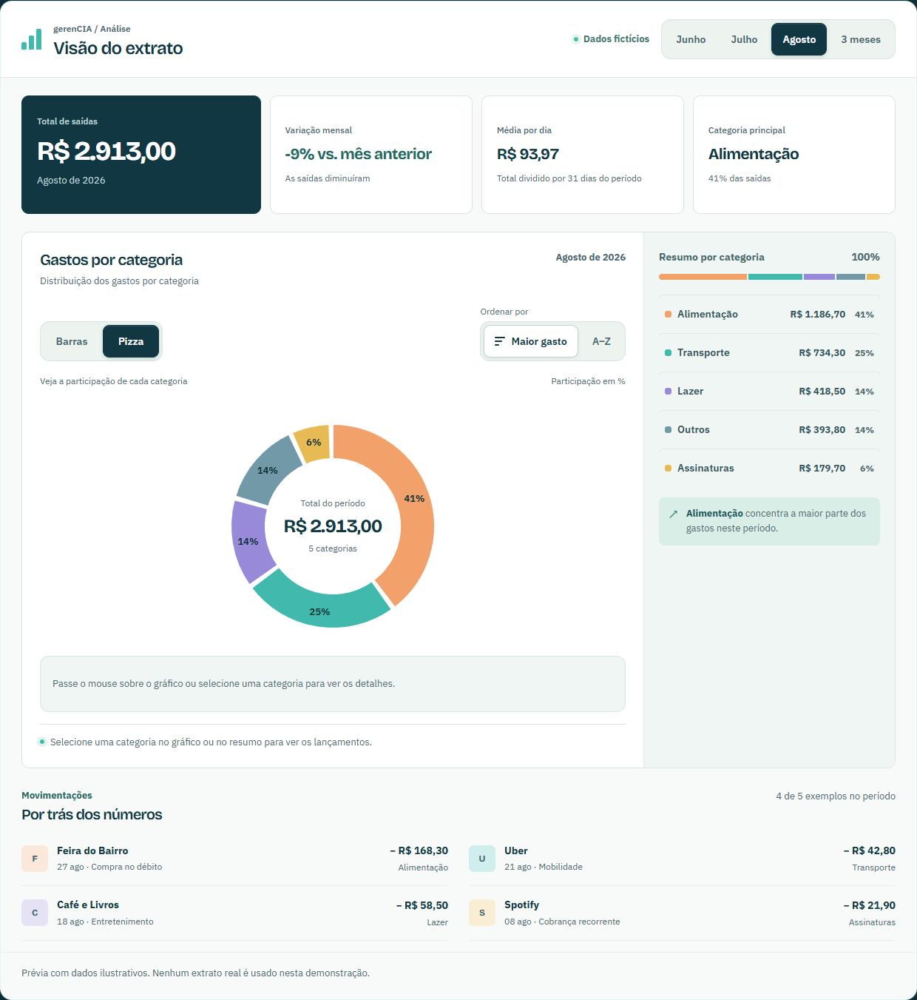
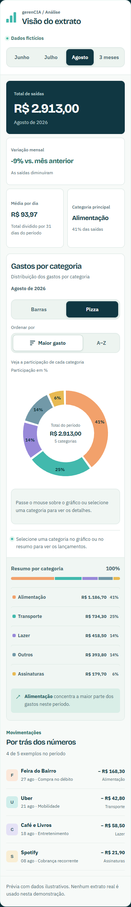
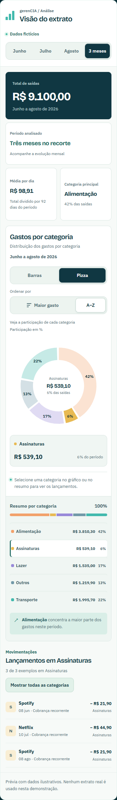

# Dashboard personalizável

Atualização de 27/09/2026. A dashboard foi separada em `frontend/src/components/dashboard/DemoDashboard.tsx`, com estilos próprios em `frontend/src/styles/dashboard.css`.

- Escolha entre barras horizontais e pizza em formato de rosca. A preferência fica salva neste navegador.
- Ordenação por maior gasto ou por categoria, também persistida. As cores de cada categoria permanecem iguais entre visualizações.
- Clique nas barras, nas fatias ou nos botões do resumo para filtrar os lançamentos. A seleção é mantida ao trocar de gráfico; trocar o período limpa o filtro.
- Percentuais dentro das fatias, valor e participação em uma faixa fixa abaixo do gráfico e valores ao lado das barras quando há espaço. No celular, o resumo mantém os valores completos disponíveis.
- O centro da rosca mostra o total do período ou o valor da categoria selecionada.
- O card de Assinaturas foi substituído por Média por dia: total de saídas dividido pelos dias corridos do período. Agosto: R$ 2.913,00 / 31 = R$ 93,97; junho: R$ 2.976,00 / 30 = R$ 99,20; três meses: R$ 9.100,00 / 92 = R$ 98,91.
- Cards de resumo com hierarquia mais clara, fundo claro, destaque no total e texto de apoio explicando as métricas. A miniatura decorativa de evolução foi retirada do total para evitar sugerir uma tendência que não vinha dos dados.
- Controles com foco visível, nomes acessíveis, estados de seleção e alternativas por teclado no resumo. Movimento reduzido respeitado, inclusive quando a preferência muda durante o uso.

Testado no Chrome headless com Playwright em 320, 390, 768, 1024 e 1440 px. Foram verificados ambos os gráficos, cliques nas formas, filtros, teclado, cálculo da média, ordenação, persistência após recarregar, resize de desktop para mobile e funcionamento com localStorage bloqueado. Axe não detectou violações A/AA nas duas visualizações; isso não substitui validação manual com leitor de tela. Resultados em [checks.json](checks.json).

Para repetir os testes com o servidor local na porta 5173 e as dependências isoladas da auditoria anterior:

```powershell
python scripts/check_dashboard.py
```








