# Revisão do frontend Gerencia

Atualização posterior: a dashboard recebeu barras/pizza e média diária. Veja [o registro atualizado](../dashboard-update/README.md).

Auditoria e implementação realizadas em 26-27/09/2026 usando product-design:audit, ui-ux-pro-max, frontend-design e design-system. Capturas da aplicação local em Chrome headless com Playwright, autorizado pelo usuário após falha de inicialização do navegador integrado.

## Resultado

A identidade existente foi preservada: azul-petróleo, verde-menta, coral e fontes Bricolage Grotesque / IBM Plex Sans. Os ajustes priorizam leitura financeira, controles previsiveis e hierarquia de conteúdo. As funcionalidades existentes continuam operacionais; login e cadastro seguem como páginas informativas.

## Etapas e evidências

| Etapa | Escopo | Achado inicial | Resultado final |
| --- | --- | --- | --- |
| 1 | Home inteira desktop: hero, apresentação, relatórios, demonstração, processo, chamada final e rodapé | Identidade consistente; texto de apoio e detalhes financeiros muito pequenos, algumas famílias tipográficas apontavam para fontes não carregadas | Saudável: tipografia padronizada, descrições ampliadas, espaçamento por hierarquia, título do hero com tratamento uniforme |
| 2 | Home inteira mobile, 320 px e tablet | Ilustracao com largura intrínseca; vários dados entre 9 e 12 px; risco de recorte escondido pelo overflow da página | Saudável: hero pode encolher, ações se reorganizam, metricas empilham no celular, categoria principal permanece visivel |
| 3 | Navegação por seções e menu compacto | Botao do menu de 38 px; não fechava com Escape; não devolvia foco ao botão | Saudável: area de 44 px, aria-controls, Escape, devolução do foco e fechamento ao sair do cabeçalho; menu compacto até 1000 px |
| 4 | Meses, trimestre, categorias e movimentacoes | Filtros funcionavam; seleção pouco evidente, hover mudava padding; contagem usava total anterior ao filtro | Saudável: controles com altura minima de 44 px, seleção com borda e texto, hover estável, limpar filtro, contagem correta e anúncio de período/total |
| 5 | Login e cadastro, ida e retorno | Paginas informativas funcionais, com texto de apoio pouco contrastante | Saudável: texto ampliado e mais contrastante, CTA consistente com a home e título da página especifico; retornos testados |
| 6 | Teclado, semântica e foco | Apenas o hero estava no landmark main; não havia link para pular navegacao; aria-label usado num strong sem papel que permitisse nome | Saudável nas verificações: todas as seis seções em main, link de salto funcional, valor final acessível sem ler cada quadro da animação, anúncio das mudanças |
| 7 | Hover, tooltip e movimento reduzido | Gráfico já respeitava preferência de movimento reduzido; instrução dizia categoria "ao lado", mesmo no mobile | Saudável: tooltip continua funcional, instrução independe da posição e transições não deslocam os controles |
| 8 | Zoom e larguras intermediárias | Precisavam de verificação do reflow e do cabeçalho | Saudável nos tamanhos testados: sem overflow horizontal e sem recortes dos controles/textos essenciais; reflow equivalente a zoom de 200% testado |

### Capturas comparáveis da página completa

Desktop antes:

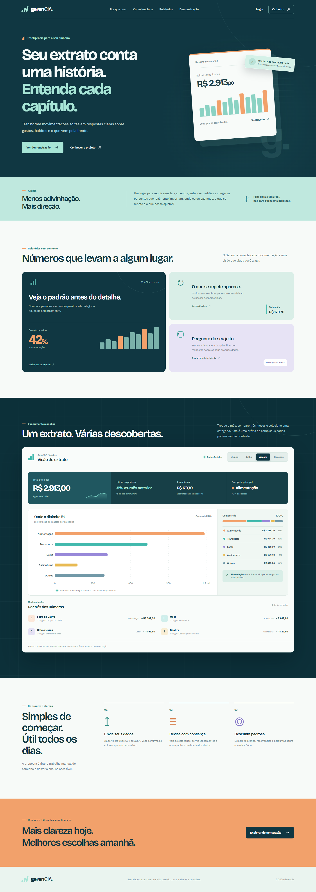

Desktop depois:

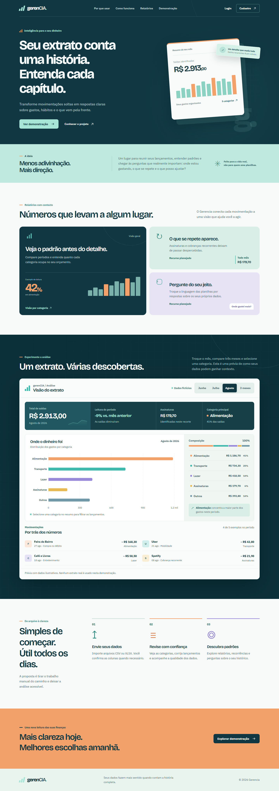

Mobile antes:


Mobile depois:

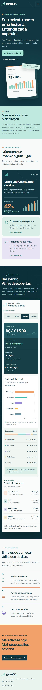

### Estados de interação e acesso

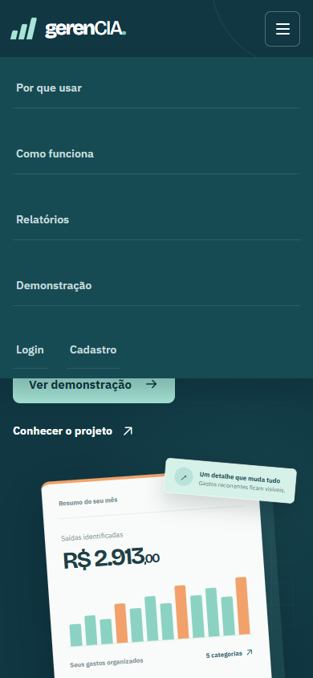

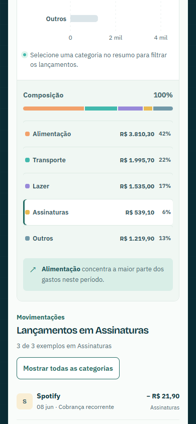

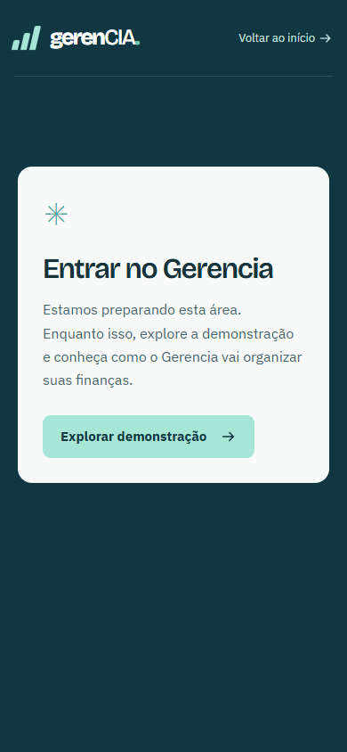

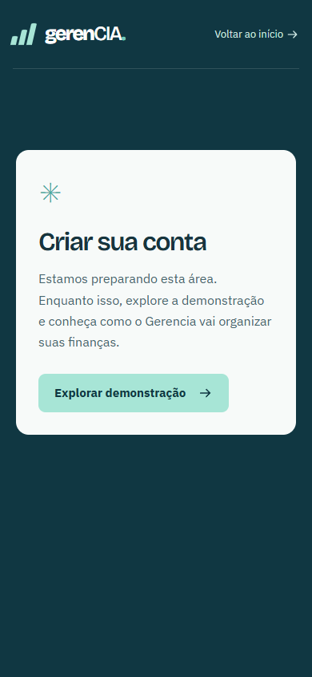

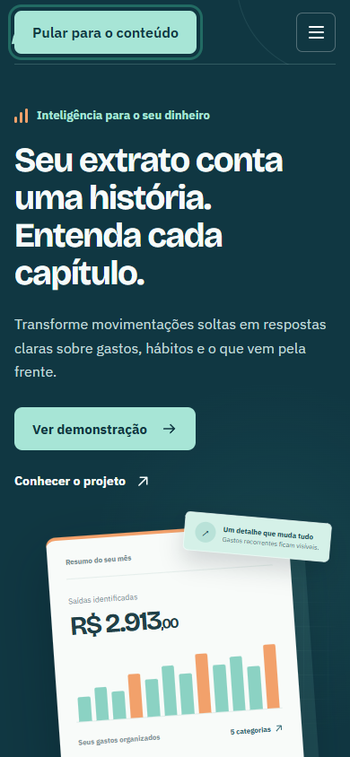

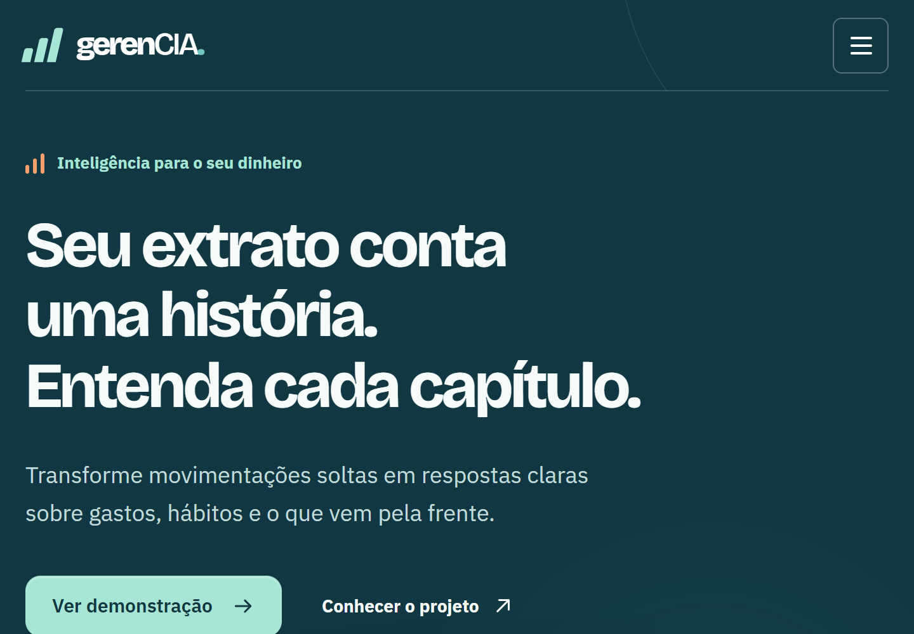

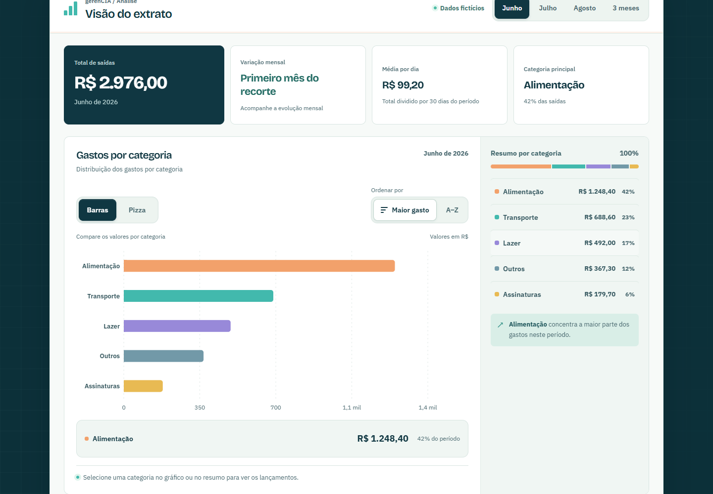

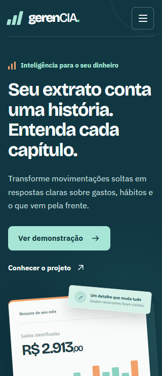

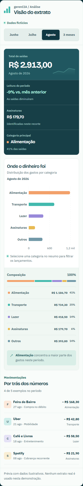

As pastas before/ e after/ incluem também tablet, filtros desktop, foco desktop e páginas de acesso desktop. As capturas foram abertas e inspecionadas durante esta revisao.

## Sistema visual implementado

- Cores base: #103742 (texto e fundo escuro), #0C3039 (demonstração), #A7E5D6 (ação), #F7FAF8 (conteúdo), #48676E (texto secundario), #F2A16B (acento existente).
- Tipografia: Bricolage Grotesque nos títulos; IBM Plex Sans no conteúdo e controles. Descrições em 15-18 px, detalhes operacionais em 12-14 px. Valores com números tabulares.
- Layout: conteúdo alinhado a esquerda, hero com duas colunas no desktop e uma coluna até 1000 px, resumo financeiro empilhado no celular. Ritmo de espaçamento e gutters compartilhados.
- Tokens em frontend/src/styles/tokens.css: primitivas, papéis semânticos e controles. Aplicados em ambas as telas de acesso e na home.
- Recursos de recorrência e assistente identificados como planejados para não parecerem destinos interativos existentes.

## Verificação

- npm run build: aprovado (TypeScript e Vite).
- Playwright 1.63.0: home, filtros, valores, contagem, limpeza, navegacao por todas as âncoras, menu, Escape, foco, páginas de acesso, retorno a demonstração, tooltip e movimento reduzido.
- Valores preservados: junho R$ 2.976,00; julho R$ 3.211,00; agosto R$ 2.913,00; trimestre R$ 9.100,00.
- Tamanhos: 320x740, 390x844, 568x320 (paisagem), 768x1024, 820x900, 1024x768 e 1440x1000.
- axe-core 4.13.0, regras WCAG A/AA 2.0, 2.1 e 2.2: zero violações detectadas nas sete larguras da home e nas páginas de login/cadastro mobile. Resultados em accessibility-checks.json.
- Três problemas detectados na primeira checagem automatizada foram corrigidos: nome ARIA do total e contraste dos labels na apresentação e chamada final.
- Sem erros de página nas capturas e sem overflow horizontal nos tamanhos testados. Verificação adicional dos limites horizontais de h1, texto do hero, botões e links de ação.

## Limites

Os testes automatizados e a inspeção visual não certificam conformidade WCAG. Não foi feita sessão manual com leitor de tela nem verificação em Safari/Firefox ou aparelhos físicos. O teste de zoom simula 200% usando viewport CSS de 720x500 e densidade 2x, equivalente a uma janela de 1440x1000; não usa o controle de zoom da interface do Chrome. Autenticação, upload e integrações reais ainda não existem neste front, portanto esses estados não foram inventados nem testados. O bundle ainda gera o aviso do Vite por ultrapassar 500 kB, principalmente pela biblioteca de gráficos; isto não impede o build.

## Reproduzir a verificação

As dependências de auditoria ficam isoladas e ignoradas pelo Git; nenhuma dependência de produção foi adicionada.

```powershell
python -m pip install --target .audit-tools playwright==1.63.0
npm install --prefix .audit-tools-js --no-save --package-lock=false axe-core@4.13.0
```

Inicie o front a partir de frontend/ com npm run dev. Com Chrome instalado e o servidor na porta 5173, execute a partir da raiz:

```powershell
python scripts/audit_front.py --verify
python scripts/check_front_accessibility.py
```

Os scripts atualizam as capturas de after/ e os resultados JSON. As evidências de before/ pertencem a esta auditoria e devem ser mantidas como referência histórica.
